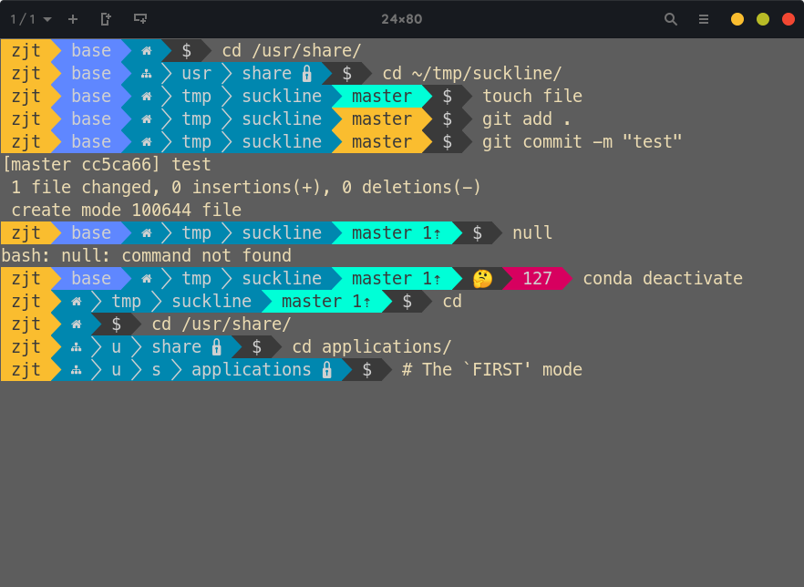

# What ?

Suckline is a [powerline-shell](https://github.com/b-ryan/powerline-shell "powerline-shell") like prompt generator with very poor functions. Screenshot↓

<p align="center">
   
   (font: MesloLGS NF)
</p>

---

# Why ?

<p align="center">
   
</p>

Basically, I'm pretty happy with the original powerline-shell program, and have it installed on my daily drivers. In most case it works very well, only except when I use my laptop without AC power supply connected. At that time, powerline-shell becomes laggy, which typically takes about 0.13 - 0.14s to show up (I have purged the default ssh/hg/jobs segment). Thus I started to think about writing a prompt generator with an appearance similar to powerline-shell in some language instead of Python. Since I'm too dumb to use GitHub under command line (and literally do not have such requirements), I could just ignore the GitHub (as well svn/hg/fossil) support, which is the most time consuming part.

Then here comes suckline. Basically it's nothing but an empty shell, since suckline does not contain most useful functions that powerline-shell has. In functionality it really sucks, and that's why it was called suckline. The only thing that suckline does good at is running speed. Under the same conditions, suckline is way faster than powerline-shell, typically it only takes about 0.015s to show up (while disabling the Git segment, this time could reduce to 0.002s). And that's enough for me.

---

# Setup

## Installation

You could simply type `make` command in the `src` directory to compile suckline. After that, you could move the binary to somewhere you'd like to. Or you may want to use `sudo make install`.

## Configuration

Suckline does not read a configure file during running, the configure file is the header file itself. You could change things in `config.h`, then recompile suckline to make it work.

## Shell support

By now suckline only supports BASH and FISH.

### BASH

Add following lines to your `.bashrc` file:

```bash
function _update_ps1() {
   PS1=$(suckline bash $?)
}
if [[ $TERM != linux && ! $PROMPT_COMMAND =~ _update_ps1 ]]; then
    PROMPT_COMMAND="_update_ps1; $PROMPT_COMMAND"
fi
```

### FISH

Define or redefine the `fish_prompt` function in your fish configuration files like this:

```fish
function fish_prompt
    suckline fish $status
end
```

# Thanks

[powerline-shell](https://github.com/b-ryan/powerline-shell "powerline-shell")

[bash-powerline](https://github.com/riobard/bash-powerline "bash-powerline")

[ANSI-color-codes.h](https://gist.github.com/RabaDabaDoba/145049536f815903c79944599c6f952a "ANSI-color-codes.h")
